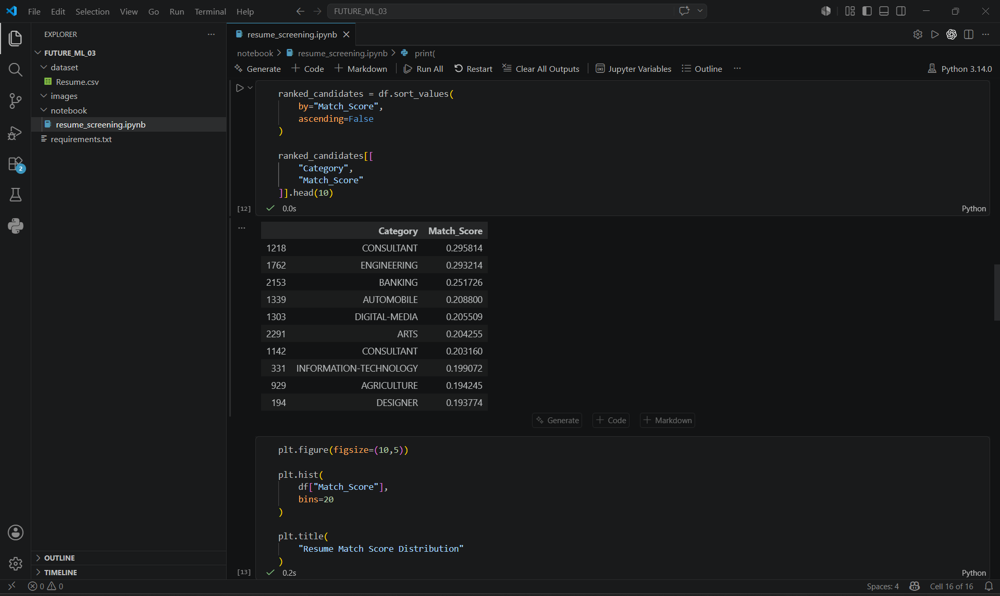
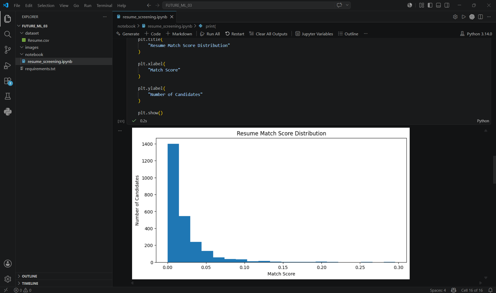
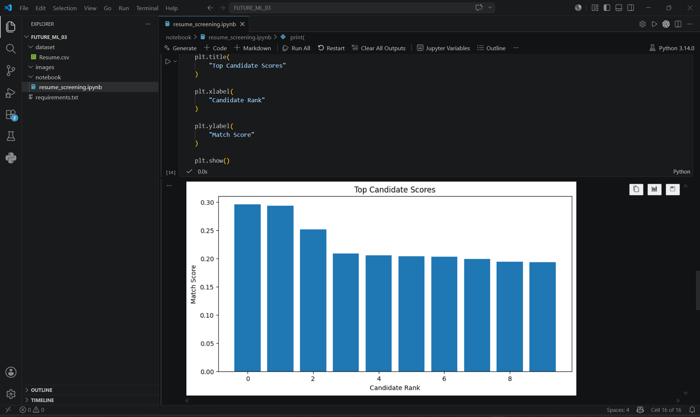
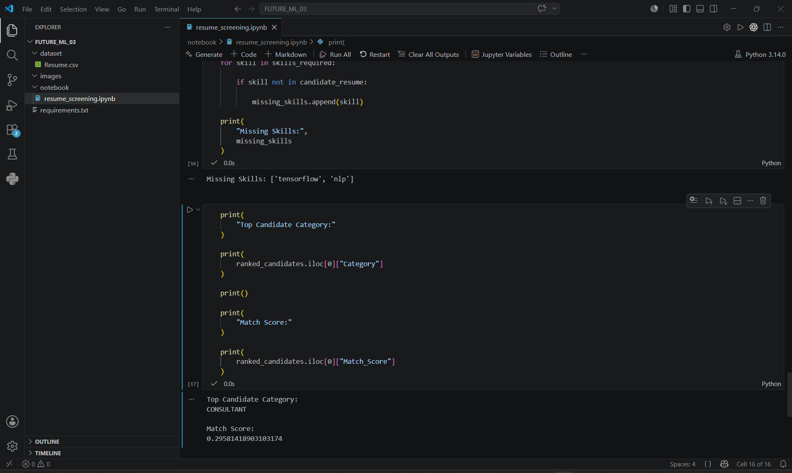

# FUTURE_ML_03

# Resume Screening and Candidate Ranking System

## Project Overview

This project is a Machine Learning and Natural Language Processing (NLP) based Resume Screening System that automatically evaluates resumes against a target job description.

The system preprocesses resume text, calculates similarity scores using TF-IDF vectorization and cosine similarity, ranks candidates based on relevance, and identifies missing skills required for the role.

This project demonstrates how AI can assist recruiters in automating candidate shortlisting and resume evaluation.

---

## Features

- Resume text preprocessing and cleaning
- Job description analysis
- TF-IDF feature extraction
- Resume-to-job similarity scoring
- Candidate ranking based on match scores
- Skill gap identification
- Data visualization and reporting

---

## Technologies Used

- Python
- Pandas
- NumPy
- Scikit-Learn
- NLTK
- Matplotlib
- Jupyter Notebook

---

## Dataset

Dataset used:

Resume Dataset (Kaggle)

The dataset contains resumes from multiple professional categories and is used to simulate candidate screening and ranking workflows.

---

## Project Structure

```text
FUTURE_ML_03/
│
├── dataset/
│   └── Resume.csv
│
├── images/
│   ├── candidate_ranking.png
│   ├── resume_score_distribution.png
│   ├── top_candidate_scores.png
│   └── skill_gap_analysis.png
│
├── notebook/
│   └── resume_screening.ipynb
│
├── requirements.txt
└── README.md
```

---

## Results

The system successfully:

- Ranked candidates according to job relevance
- Calculated resume match scores
- Identified top-performing candidates
- Highlighted missing skills required for the target role
- Generated visual insights through ranking and distribution charts

---

## Screenshots

### Candidate Ranking



### Resume Score Distribution



### Top Candidate Scores



### Skill Gap Analysis



---

## Future Interns - Task 3

Resume / Candidate Screening System using Machine Learning and NLP.
